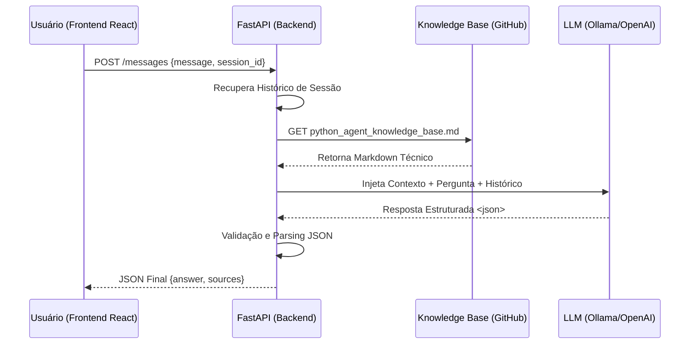

# 🛡️ TCE-CE Agente de IA Técnico (Python Agent Challenge)

Este repositório contém uma solução completa para o desafio técnico do TCE-CE: um assistente virtual inteligente capaz de realizar **RAG (Retrieval-Augmented Generation)** sobre uma base de conhecimento técnica externa em tempo real.

---

## 🚀 Guia de Início Rápido (Quick Start)

A solução foi projetada para rodar de forma totalmente isolada via **Docker Compose**. Siga as instruções abaixo para cada cenário.

### 📋 Pré-requisitos
- Docker e Docker Compose instalados.
- Se for rodar localmente: **Ollama** rodando no host.

### 1️⃣ Cenário A: Execução Local (Ollama) - RECOMENDADO
Ideal para demonstrações sem custo de API. Utiliza o modelo **Llama 3.1 (8B)**.

1.  Certifique-se de que o Ollama está rodando e o modelo baixado (`ollama pull llama3.1`).
2.  No diretório raiz, execute:
    ```bash
    make run-local
    ```
3.  Acesse a interface em: **[http://localhost:5173](http://localhost:5173)**

### 2️⃣ Cenário B: Execução em Nuvem (OpenAI)
Ideal para performance máxima e precisão superior.

1.  Edite o arquivo `.env` e insira sua `OPENAI_API_KEY`.
2.  No diretório raiz, execute:
    ```bash
    make run-openai
    ```
3.  Acesse a interface em: **[http://localhost:5173](http://localhost:5173)**

---

## 🏗️ Arquitetura do Sistema

O projeto segue o padrão **Semi-Agentic RAG**, separando a lógica de inteligência da interface de usuário.

### 🔄 Fluxo de Mensagem (Diagrama de Sequência)



### 🧱 Componentes Principais
- **Frontend (React/Vite):** Interface moderna com Dark Mode, suporte a Markdown e visualização de fontes consultadas.
- **Backend (FastAPI):** Orquestrador assíncrono que gerencia as requisições e o contexto de sessão.
- **Core Agent (LangChain):** Motor de inteligência que utiliza ferramentas para consultar a base externa.
- **Robustez:** Implementação de parsing rígido via XML Tags para garantir respostas estruturadas em modelos de menor escala.

---

## 📄 Decisões Técnicas & Governança (Manual do Entrevistador)

-   **Isolamento de Sessão:** Cada conversa possui um `session_id` único gerado pelo frontend. O backend mantém o contexto de até 10 interações por sessão para garantir fluidez sem estourar o limite de tokens.
-   **Anti-Alucinação (Zero-Knowledge Base):** O agente é instruído a ser um "especialista ignorante": se a informação não constar explicitamente na Base de Conhecimento, ele declara que não encontrou a informação, evitando inventar fatos.
-   **Encoding UTF-8:** Implementado suporte total a acentuação (Português-BR) em todas as camadas, desde a captura na KB até a renderização no React.
-   **Rastreabilidade:** Cada resposta inclui o campo `sources`, listando os títulos das seções consultadas na KB para auditoria imediata.

---

## 🌐 Endpoints e Ferramentas

| Recurso | URL | Descrição |
| :--- | :--- | :--- |
| **Interface de Produção** | `http://localhost:5173` | UI Completa (React/Vite) |
| **Lab de Debug** | `http://localhost:8000/debug` | Ambiente minimalista para testes de API |
| **API Docs (Swagger)** | `http://localhost:8000/docs` | Documentação técnica das rotas |
| **Health Check** | `http://localhost:8000/health` | Status de saúde do sistema |

---

## 🧪 Testes de Qualidade

Para garantir a integridade do sistema após alterações:
```bash
# Roda os testes unitários e de integração (API)
make test
```

---
**Desenvolvido com excelência técnica para o Desafio TCE-CE 2026.**

---

## 🧭 Manual do Candidato (Dicas para a Entrevista)

Como o sistema utiliza **Llama 3.1 local**, aqui estão algumas "perguntas de ouro" para demonstrar a robustez do agente:

1.  **Teste de Especialidade:** "Explique a diferença entre Composição e Herança segundo a base."  
    *O que observar:* Ele deve listar as fontes (Definição, Ponto de Atenção) e ser técnico.
2.  **Teste de Pegadinha (Nuance):** "É correto colocar regra de negócio no Endpoint?"  
    *O que observar:* Ele deve citar que, embora não recomendado, a base diz ser aceitável em projetos pequenos/MVPs.
3.  **Teste de Fallback (Anti-Alucinação):** "Como configuro o banco de dados PostgreSQL?"  
    *O que observar:* Ele deve responder educadamente que não encontrou a informação na base técnica.
4.  **Teste de Persistência:** Faça uma pergunta, depois pergunte: "Pode me dar outro exemplo disso?"  
    *O que observar:* O agente usa o histórico da sessão para entender que "disso" refere-se ao tópico anterior.

---
